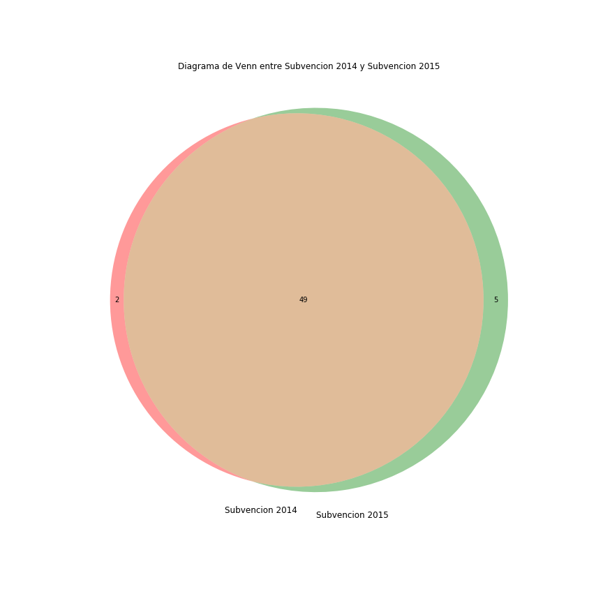

Se muestra un diagrama de Venn sobre las subvenciones a entidades deportivas de Alcobendas en los años 2014 y 2015. El proposito del gráfico es mostrar si las entidades deportivas reciben la subvención cada año, o si por el contrario no se muestra que haya solapamiento entre 2014 y 2015, lo que indicaría que cada año la subvención se otorga a diferentes entidades deportivas

Como observamos en el gráfico, hasta 49 entidades deportivas se solapan en los años 2014 y 2015, lo que indica que recibieron la subvención los 2 años. Por el contrario, solo 2 entidades deportivas recibieron la subvención en 2014 y no en 2015 y solo 5 entidades deportivas la recibieron en 2015 y no 2014.
